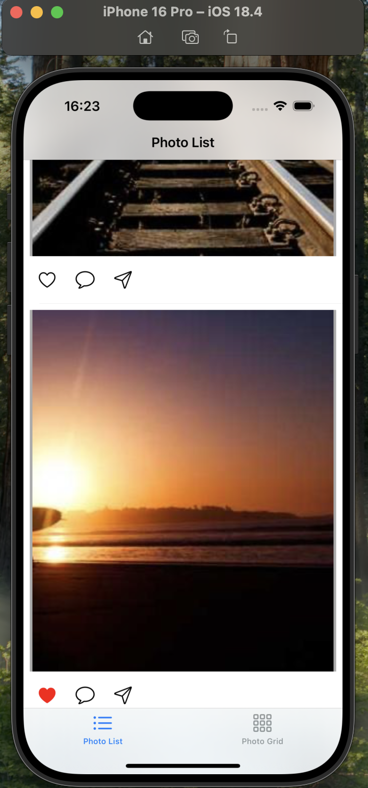
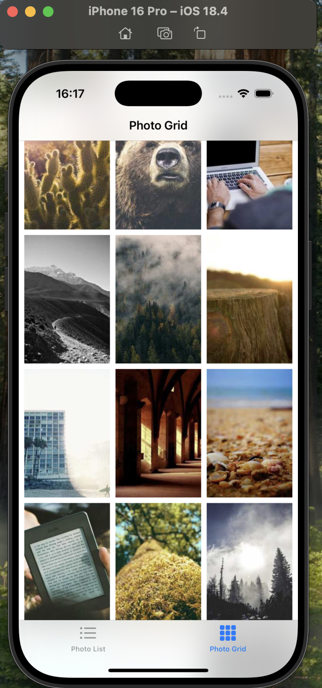
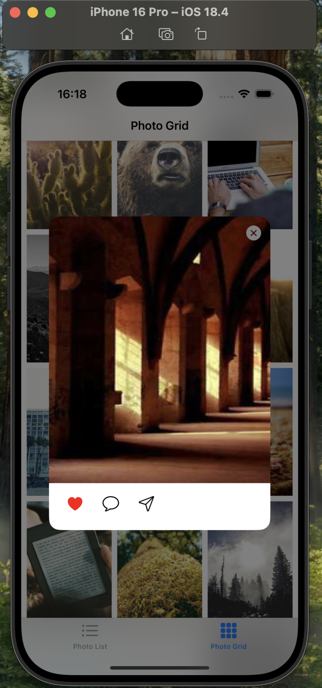

# ImageScroll

iOS приложение для просмотра фотографий в сетке и карточках.

## Функционал
- Сетка фотографий и список фотографий отображаются непрерывным списком.
- Лайки на изображениях.
- Возможность открытия картинки из списка сетки

## Установка
1. Склонируйте: `git clone https://github.com/kodi4k/Image-Scroll.git`
2. Откройте `Image-Scroll.xcodeproj` в Xcode.
3. Xcode автоматически загрузит зависимости через Swift Package Manager.
4. Скомпилируйте и запустите.

## Зависимости
- SDWebImage (via Swift Package Manager)
## Скриншоты:

- 
- 
- 

